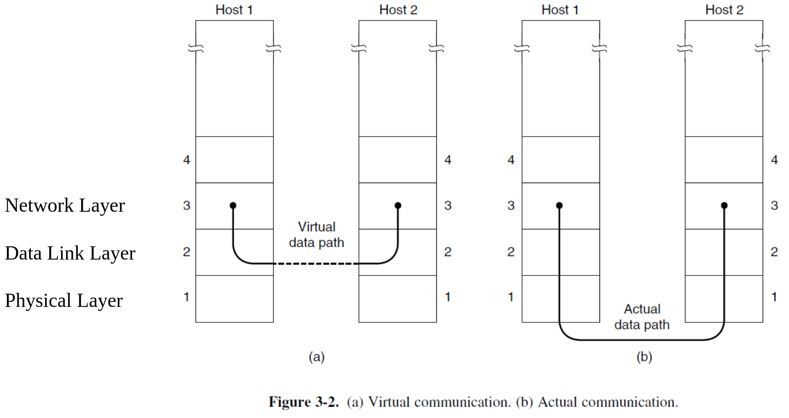
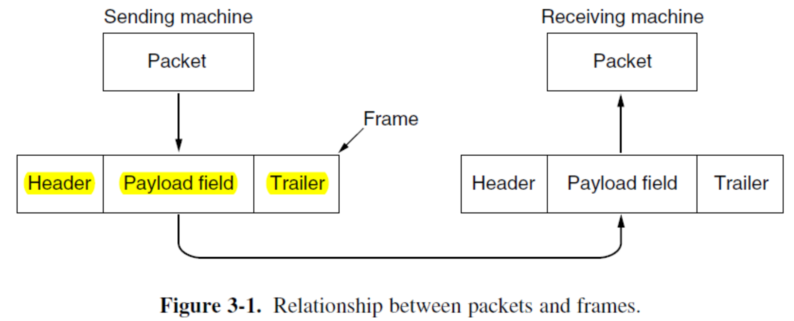
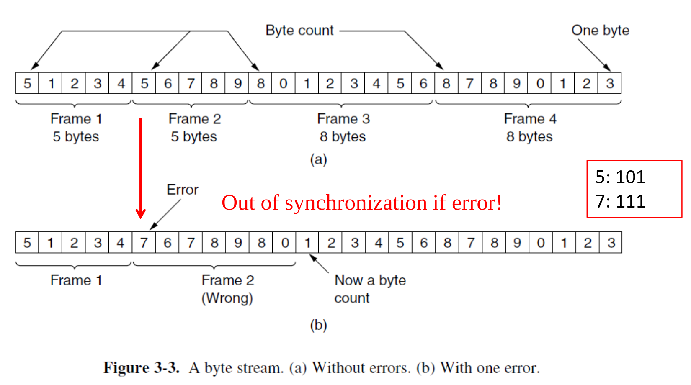
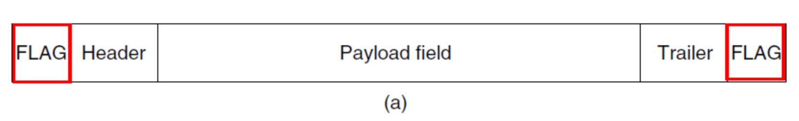
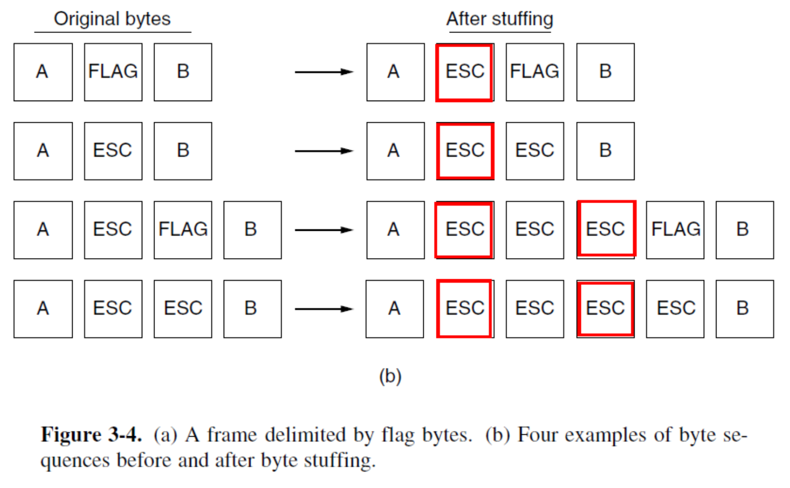
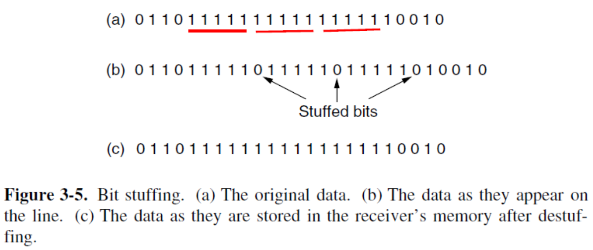
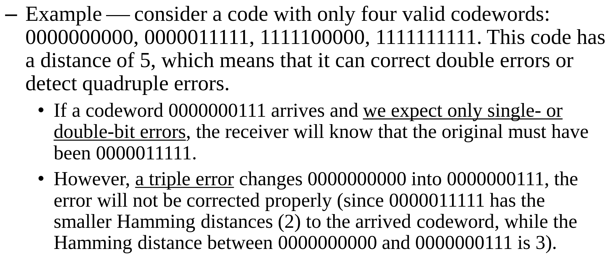
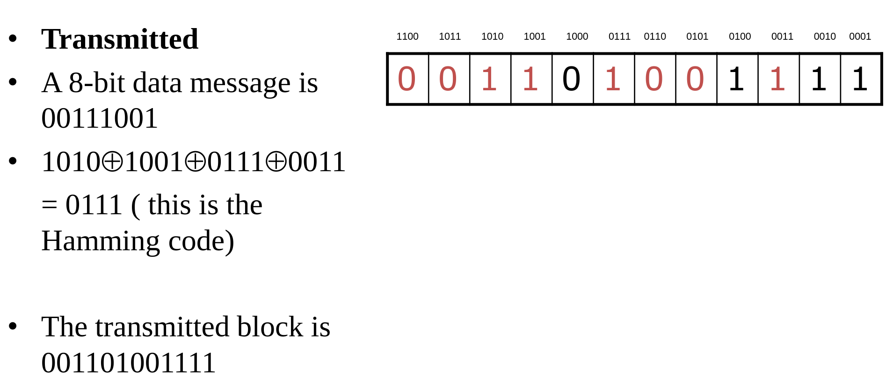
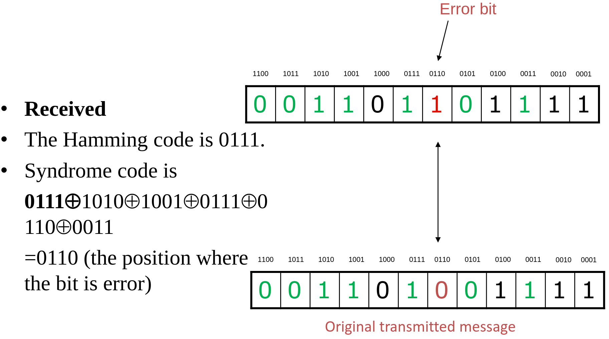
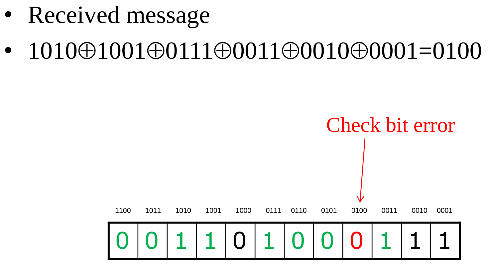

# Data Link Layer 数据链路层

## Overview 总览

Data Link Layer只负责直连的两台设备之间（比如电脑到路由器，或者路由器到下一个路由器）的通信。它不管数据最终要去地球的哪一端（那是网络层 IP 协议的事），它只管提供可靠、高效的连接，并且能够按照正确的顺序传输bits

物理信道主要存在Errors、Finite data rate、Propagation Delay这几个问题，而Data Link Layer的功能就是为了解决这些问题而设计的：分帧 Framing、错误控制 Error control (detection & correction)、流量控制 Flow Control

Framing：把比特切成一段段，打包成Frame

Error control：发送方怎么知道数据有没有正确抵达？可以通过ACK (Acknowledgement)、计时器 (timer)、sequence numbers来知道

Flow control：如何防止发送太快导致接收方过载？在Data Link Layer，使用反馈式的Feedback-based flow control (receiver gives sender permission)；而在后续的Transportation Layer中，会讲到更为精确的Rate-based flow control (limit the data rate at which the sender may transmit data)

Data Link Layer的主要功能就是为Network Layer提供服务：

在普通主机上，数据链路层大部分的工作由NIC网卡完成，小部分较高级的链路层功能是由运行在 CPU 上的软件实现的。在路由器中，链路层是实现在Line Card (线路卡/接口板) 上的。路由器的设计通常是模块化的，每个接口卡都有自己独立的链路层处理芯片，以此来保证高速转发。

Data Link Layer为Network Layer提供的服务包含：

1. Unacknowledged Connectionless Service 无确认无连接：发送方把数据帧扔出去就不管了，接收方收到后也不会回复自己收到了，数据链路层不负责重传，全当无事发生；发送之前不需要建立连接，想发就发。适用于error rate极低（例如光纤或高质量的双绞线）和对实时性要求较高（例如语音通话）的情况。典型代表是Ethernet，就是平时插网线用的那个。
2. Acknowledged Connectionless Service 有确认无连接：传输过程需要确认，引入ACK、timer等机制；但依然不需要提前建立连接。适用不可靠的信道unreliable channels，例如无线环境。典型代表是802.11 Wifi。
3. Acknowledged Connection-oriented Service 有确认有连接：要求先建立连接，然后开始传输。传输的过程中需要确认。传完后，显式地断开连接，释放资源。适用于长距离long distance、不可靠unreliable的情况。典型代表是satellite channel和long-distance telephone circuit。

## Framing 分帧

Data Link Layer从Network Layer接受Packets，并封装为Frame以便传输。

通常来说，Frame包含Header、Payload、Trailer三个部分：

Data Link Layer通常将比特流分割成离散的Frame，为每个Frame计算一个checksum，并在发送Frame时将校验和包含在Frame中。当帧到达目的地时，接收端会重新计算checksum。如果新计算的checksum与帧中包含的checksum不同，Data Link Layer就知道发生了错误，从而进行处理

如何实现分帧Framing？有下面四种方法。

### Byte Count

每个Frame最开头用一个Byte表示这个Frame的总长度（包含这个Byte）

但是噪声是不长眼睛的，一旦Frame 2的第一个Byte变成了111(7)，就会导致后面所有的顺序都乱掉

### Flag Bytes with Byte Stuffing

使用同一个Byte，叫做Flag Byte作为起始和结束分隔符。在每一帧的开头放一个，在结尾也放一个：

如果中间出了错，接收方不知道读到哪了，它只需要一直丢弃数据，直到再次看见两个连续的FLAG，就能立刻重新找到下一帧的起点

但一定会出现这种情况，要传输数据本身恰好包含了这串FLAG，解决方法是在每个这种地方的前面插入一个Escape Byte，即ESC。FLAG -> ESC FLAG

那么如果数据本身还恰好包含了这串ESC，怎么办？那就在它前面再加一个ESC就可以。ESC -> ESC ESC

使用Byte Stuffing的例子：PPP (Point-to-Point Protocol)

### Flag Bytes with Bit Stuffing

Framing也可以在bit级别完成

使用Bit Stuffing的例子：HDLC (High-Level Data Link Control) Protocol，USB

HDLC每个Frame都由0x7E(01111110)开始、结束。只要发送的数据中包含连续的5个1，就自动插入一个0，从而防止数据出现连续6个1的情况，从而保证只要出现6个1，就一定是Flag。接受时，只要看到5个1，如果后面是0，直接去掉这个0；如果后面是1，就一定是FLAG。这样做的好处是开销很小

### Physical Layer Coding Violations

如果物理层的编码本身就有冗余，能不能找一些“物理上非法”的信号，专门用来标记“开始”和“结束”？因为数据里绝对不可能出现这种非法信号，所以根本不需要填充。

以上面的曼彻斯特编码为例，高变低表示1，低变高表示0。那么冗余的“高高”“低低”，就可以作为控制信号使用。

另外一个例子是光纤中采用的4B/5B编码。它会把4位数据映射成5位信号发送，这意味着有$2^5-2^4=16$中组合是冗余的，那么就可以从这多余的16种信号里选择合适的作为控制信号。

### Combination

现代协议（如 Ethernet, 802.11 WiFi）通常不只用一种方法。首先发送一段很长的前导码Preamble让接收端准备好，例如802.11有72bits。然后使用Header中的Length Field来界定这个Frame在哪里结束

## Error Control

网络的设计者设计了两种基本的策略来处理错误。这两种方法的本质是一样的，即加入一些能帮我们检测/纠错的冗余信息。

第一种方式，加入足够多的信息，让接收端能够推断出正确的信息是什么，这就是Error-Correcting Codes。这种方式通常用于不可靠的信道，例如Wireless Link。因为接收端如果仅仅知道需要重传，但重传的信息仍然可能是错误的。

第二种方式，只加入必要的信息，让接收端能发现出错，要求重传，这就是Error-Detection Codes。这种方式通常用于高可靠性的信道，例如光纤。相比Error-Correcting Codes，这种方式更加便宜

噪声是不长眼睛的，提供保护的冗余位与数据位一样，都可能被错误接收，因此无论何种方式都无法处理所有错误

通常认为有两种错误模型：一种认为错误是由于热引起的，会导致某个bit翻转；另一种认为错误总是一阵一阵出现come in bursts，而不是单个出现

以上策略不仅仅用于Data Link Layer，Error-Correcting Codes就可以用于物理层，Error-Detecting Codes也可以用于网络层、传输层等等

### Error Correction

Block Code：把数据切成一个个长度为m的块，然后给每一组算出一个r位的校验，拼在一起发出去，长度为n=m+r。在Systematic Code中，原始数据是原封不动地放在那里的，同时在某些地方附上校验位，而不是在发送前进行编码。在Linear Code中，校验位是通过把m位进行线性运算得到的

#### Hamming Codes

Hamming distance：两个长度相同的二进制串，对应位上bit值不同的个数。计算方法是进行异或，然后统计结果中1的个数

对于一个编码方案（码本），也可以计算其Hamming distance。找出任意两个合法码字，算出它们之间的距离。在所有这些距离中，最小的那个值，就是整个编码系统的Hamming distance。这可以理解为“木桶效应”，系统的纠错能力取决于它最薄弱的一环。只有最小汉明距离足够大，系统才足够安全

为了衡量编码效率，使用公式：$Code Rate=m/n$。在噪声较大的信道中，该值可能只有$1/2$，即有一半都是冗余。在高质量的信道中，该值接近$1$，只使用很少的校验位

如果要detect $d$个错误，则码本的Hamming distance至少为$d+1$

如果要correct $d$个错误，则码本的Hamming distance至少为$2d+1$

以下是一个例子：

如果想要传输m位数据，并且想具备纠正1位错误的能力，凑多少个冗余位r才够用？

答案为$(m+r+1)\leq2^r$

推导时，可以这样想：r个校验位能指示$2^r$种状态，我们需要这些状态来表示发生了什么。如果无事发生（没有错误），需要1个状态；第一位错了，需要1个状态；...；第m+r位错了，需要1个状态。因此总共会有$(1+m+r)$个状态，而我们的校验位必须足以表示所有状态，因此$(m+r+1)\leq2^r$

应用此公式，如果我们想发送7位数据（m=7），代入后得到$(8+r)\leq2^r$，满足此条件的最小r为4，那么就说明我们至少需要4个冗余位来纠正1位错误。

在发送时，先预先空出来所有2的幂次的位，比如Position 1，2，4，8等等。假设我们要发送的数据是00111001，我们将其按照least-significant position方向填写在没有被预先空出来的那些位里面。然后，我们就可以知道哪些数据位被填了1，把这些位的序号（图中为1010，1001，0111，0011）进行异或，得到0111，这个结果就是Hamming code，将其按照least-significant position方向填入我们预先空出来的位置就可以了

注意，数据和code的低位应当对应更小的Position，如果题目中小的Position位于左边，那么两者都必须反过来填

在接收时，将值为1的**所有位的序号**异或，得到0110，恰好指向了错误的那个数据位。

但是，错误不一定只会出现在数据中，校验位同样可能出错：

如上图，将值为1的**所有位的序号**进行异或，得到0100，指向了出错的校验位。不过，校验位不需要我们纠错

总结一下，如果异或结果全部为0，则说明没有错误；如果异或结果中仅有一个bit为1，说明错误位于校验位，不需要纠正；如果异或结果有多个bit为1，则必须把对应的bit翻转

#### Binary Convolutional Codes (应该不会考)

### Error Detection