# Physical Layer

## Theoretical Basis

### Bandwidth-limited Signals 带限信号

**Cutoff Frequency ($f_c$, 截止频率)**: Usually, for a wire, the amplitudes are transmitted mostly undiminished from 0 up to some frequency $f_c$ (measured in cycles/sec or Hz), with all frequencies above this cutoff frequency attenuated.

**Bandwidth (带宽)**: 从最低$f$到$f_c$, 以Hz为单位

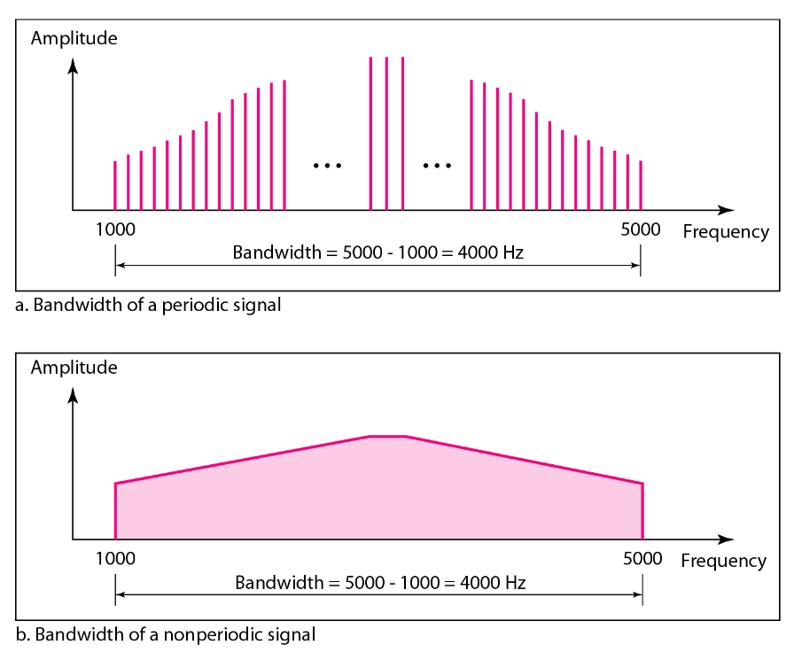

**Baseband Signals (基带信号) vs. Passband Signals (通带信号)**

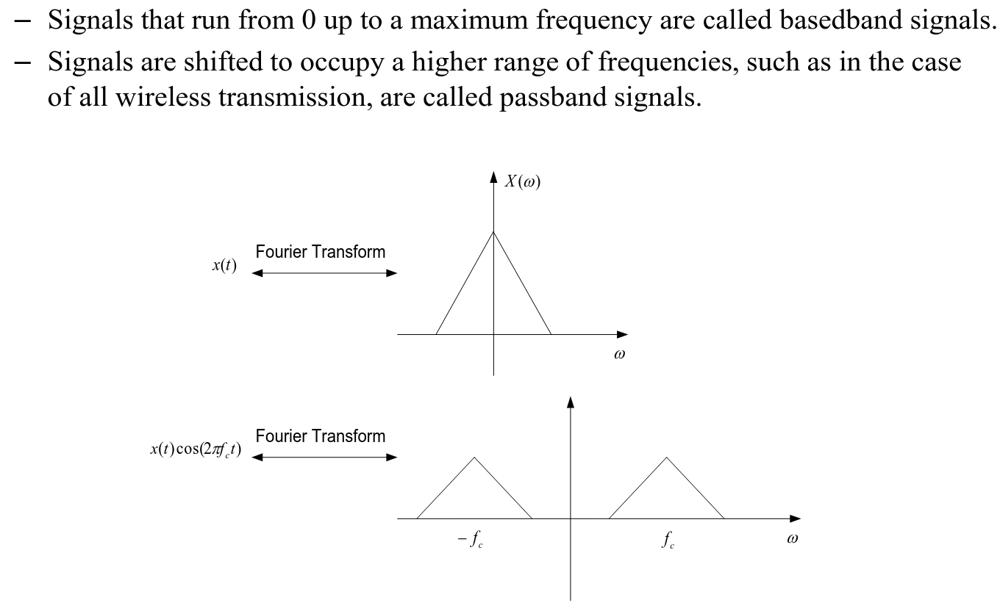

Baseband Signals是原始信息信号，适合在有线介质中进行短距离传输, 基带信号通过调制 (Modulation) 搭载到高频载波信号上, 成为Passband Signals

Passband Signals适合无线传输

**Amplitude Modulation (调幅) vs. Frequency Modulation (调频)**

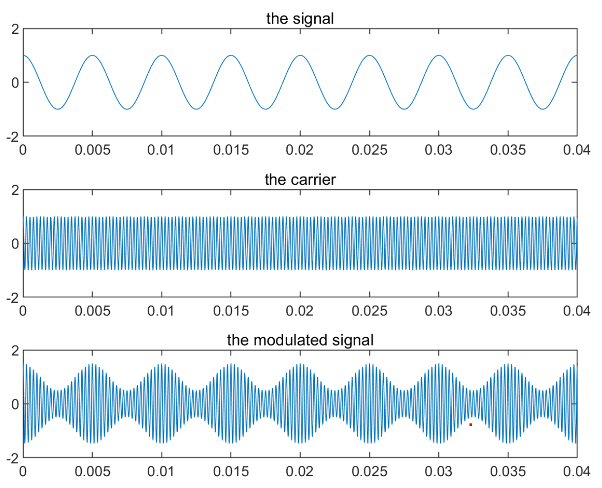

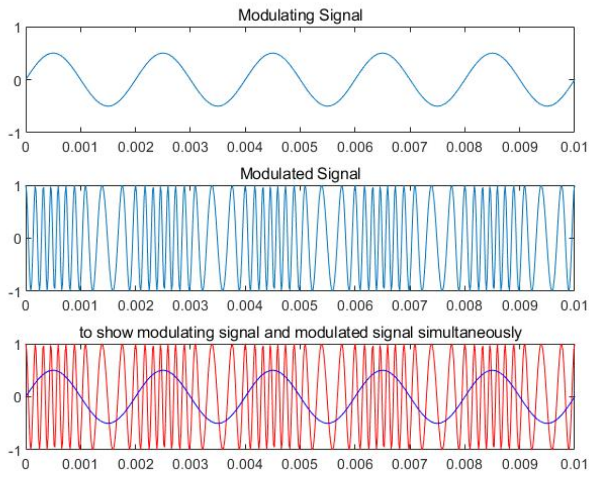

**Bandwidth vs. Maximum Data Rate**

对于electrical engineers, (analogue) bandwidth用Hz衡量

对于computer scientists, (digital) bandwidth表示maximum data rate (最大数据传输速率), 用bits/sec衡量

两者直接相关

### The Maximum Data Rate of a Channel

**Channel Capacity 信道容量**

The maximum rate (最大传输速率) at which data can be transmitted over a given communication path or channel under given conditions

**Related Concepts**

Data rate (bps, bits/sec)

Bandwidth: 每一路信号之间, 可能需要加上一定的间隔, 叫做guide interval; 一般来说, 带宽越大, 成本越高, optical fiber (光纤) 是目前成本最高的communication system

Noise: 噪声一般是随机的, 并且在不同频率下的影响可能不一样. 噪声高会导致Data rate下降, Error rate增大

Error rate: 传输的bit和接受的bit不一致, 就是发生了error.

### Nyquist Bandwidth

无噪声的信道 (perfect channel) 的传输容量 (transmission capacity) 依然是有限的, 本质就是因为带限

**Inter-Symbol Interference (ISI)**

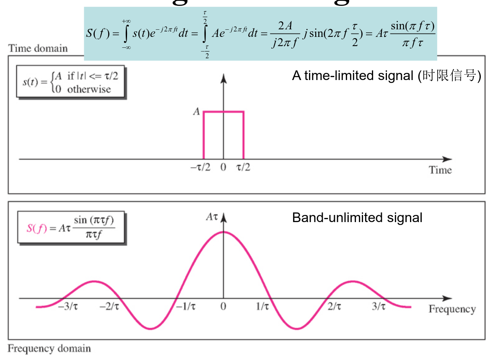

图中的一个脉冲信号，是一个时限信号，经过傅里叶变换后可以看到它是一个**非带限信号**. 反过来，一个带限信号也只能是非时限信号. 一个时间上的方波脉冲，在频率上相当于$sinc(x)=\displaystyle\frac{\sin{\pi x}}{\pi x}$函数. 一个时间上的$sinc(x)$函数，在频率上相当于方波脉冲. 有限带宽会导致矩形脉冲的“理想方形”不再保持，边沿过渡区域会被拉长变斜

**Nyquist criterion for zero ISI**

在一个带宽只有$B$的信道上, 最快能以多块的速度$R_s$发送信号, 同时保证信号之间不互相干扰:

(1) 选择特殊的脉冲形状：$g(t)=\displaystyle\frac{\sin{2\pi Bt}}{2\pi Bt}$, 即带宽为$B$的矩形脉冲

(2) 最大符号速率 (maximum symbol rate): $R_s=2B (symbols/sec)$

**From symbol rate to bit rate**

这里一定要注意区分symbol rate, bit rate, 以及data rate的区别

symbol rate (也叫 baud rate, 波特率) 就是每秒可以传输多少个符号. 假设我们的信道带宽$B=1000 Hz$. 在这个例子中，最大符号速率$Rs​=2\times1000=2000(symbols/sec)$.

如果每个symbol只有两种状态, 即$\log_{2}{2}=1$个bit, 那么每秒传输的bit数目bit rate就是$2000\times1=2000(bits/sec)$

而一般来说, 传输的信息还包含纠错用的bits, 因此有效数据的量少于接收到的bits的量, 用data rate表示

**所以我们不难得出maximum bit rate的公式$C=2B\log_{2}{V}$, 其中$V$是一个symbol状态的数目**

但必须注意, 这里的$V$不是无限增长的, 因为处理这样的信号会变得越来越复杂

### Shannon Capacity

对于有高斯白噪声 (AWGN, additive white Gaussian noise) 的, 有带限的信道, $C=B\log_{2}{(1+SNR)}$, 其中$SNR$是**线性尺度下的信噪比 (signal-to-noise ratio in linear scale, not in dB)**, 实际上是无法达到这个最大值的

两种尺度下信噪比的转换公式: ${SNR}_{dB}=10\log_{10}{SNR}$

当信噪比较高时, 提升带宽可以显著增大$C$. 但信噪比较低时, 增大带宽带来的好处很小, 此时应该通过增大信号功率实现$C$的提升

对于同一个noise pattern, 如果提高了data rate, 则bits的时长变短了, 从而相同的noise可以影响到更多的bits

## Three Kinds of Transmission Media

Guided/Wired, Wireless, Satellite

### Guided Transmission Media

#### Persistent Storage 储存体

即磁盘/固态存储器, 使用物理运输方式 (如卡车) 传输, 带宽可以非常大, 延迟很高

#### Twisted Pairs 双绞线

是最古老的, 但也是用得最多的传输方式, 由两根绝缘铜线组成, 缠绕是为了防止两根平行线构成天线. 一般使用两根线中**电压的差值**来传输信号, 因为噪声往往对两条线施加相同的影响, 从而可以相减抵消. 模拟信号和数字信号都可以用双绞线传输. 双绞线的带宽取决于线粗和传输距离, 几公里的长度可以达到数Mbits.

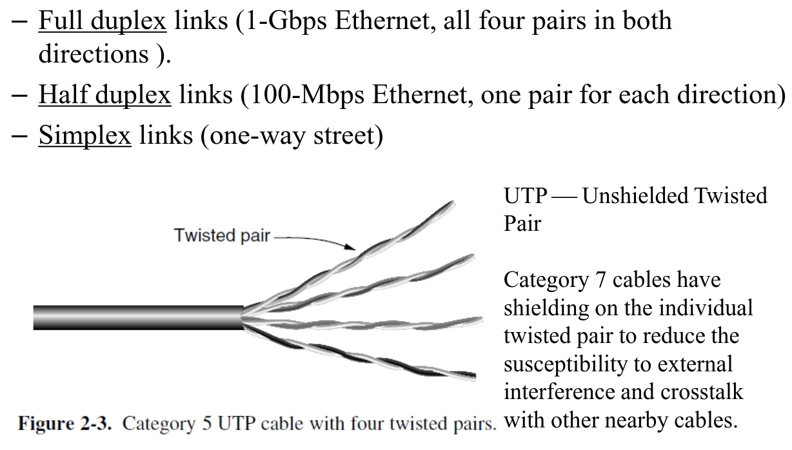

全双工: 双向传输，可以同时

半双工: 双向传输，但不能同时

单工: 只能单向传输

常见的网线 (CAT 5) 是非屏蔽双绞线 (UTP)，依靠“缠绕”来抗干扰. 更高级的网线 (CAT 7) 则会在“缠绕”的基础上，为每一对线都增加屏蔽层，以实现更强的抗干扰能力和更高的数据速率

#### Coaxial Cable 同轴电缆

用于有线电视/城域网 (MAN)/高速互联网接入, 带宽可以达到GHz

#### Power Lines 电线

将高频信号叠加在低频信号 (50Hz) 上进行传输

电线本身设计就只为了传输电力, 当电器开关就会造成波动, 并且瞬态电流会在很宽的频率范围内产生噪声

#### Fiber Optics 光纤

带宽基本上是无限的, 由三部分组成: Light source, transmission medium, and detector

光线通过玻璃的衰减定义为输入与输出信号功率之比, 取决于光的波长

光纤电缆类似于同轴电缆, 只是没有那层编织网 (braid)

有两种信号光源: LED, Semiconductor lasers

光的常用波长有三个区域：

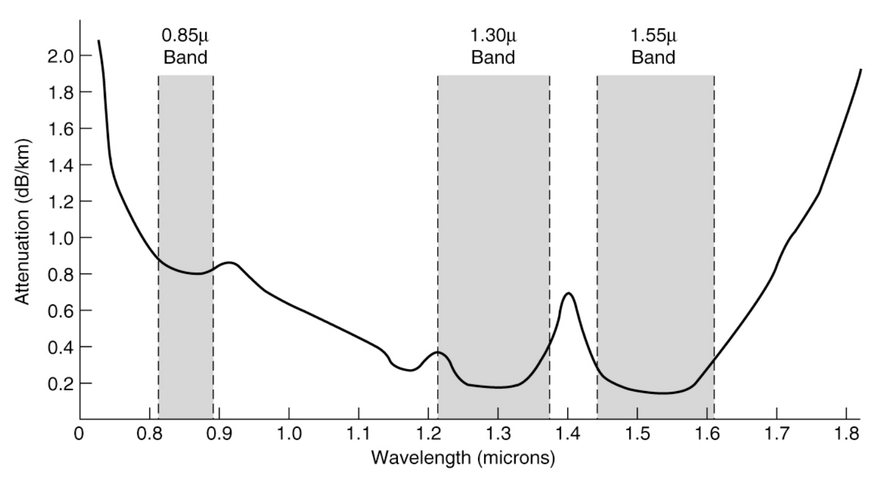

0.85-micron的波段常用于短距离的传输, 因为衰减最快

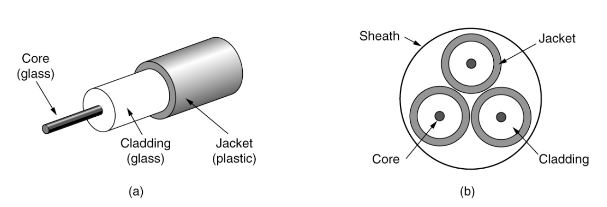

(a) core的折射率高于classing的折射率

(b) 展示了多模光纤 (multimode fiber), 另外还有单模光纤 (single-mode fiber), 更细

光纤的优点: 带宽大, 不受电涌 (power surges), 电磁干扰, 电源故障, 化学物质的影响, 重量轻, 不会漏光, 难以窃听 (tap)

光纤的缺点: 容易因弯曲过多而损坏

### Wireless

传统无线传输使用窄带传输 (Narrow Frequency Band). $\Delta f$是信号占据的带宽（频带宽度），$f$是中心频率。$\Delta f/f \ll 1$表示带宽相对于中心频率来说非常小

但是在三种特殊情况下, 使用了更宽的带宽:

(1) Frequency hopping spread spectrum 跳频技术, 每秒钟会改变数百次频率, 在蓝牙和802.11协议的旧版本中使用

(2) Direct sequence spread spectrum, 例如CDMA

(3) UWB (Ultra WideBand) 超宽带, 发射一系列短脉冲传输数据, 这种脉冲会分布到超宽的频率上

#### Radio Transmission 无线电

无线电波向各个方向发射, 因此发射天线和接收天线不必对准

在低频下, 无线电波容易穿过障碍物，但功率随着距离急剧下降，在空气中至少快到$1/r^2$, 这种衰减称为path loss

在高频下, 无线电波倾向于直线传播, 并且更容易发生反射

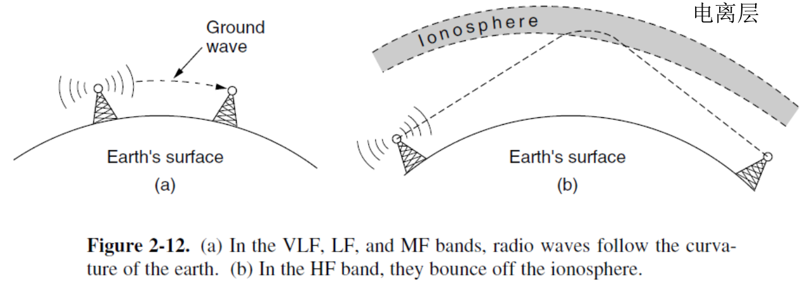

无线电波可以通过地波传播, 也可以经过大气层反射传播 (仅HF)

#### Microwave Transmission 微波

微波的频率更高, 几乎沿直线传播, 可以通过抛物面天线 (parabolic antenna) 获得更高的SNR, 但发射天线和接收天线必须对齐

如果塔架距离太远, 地球曲率会阻挡信号, 因此需要周期性地摆放中继器, 中继器的间距大致与$\sqrt{H}$成正比, 其中$H$是塔架高度

Multipath Fading: 当信号通过多条路径到达接收器时，这些延迟的波可能会与直射波异相到达，导致相互抵消，信号减弱甚至消失

#### Infrared Transmission 红外

用于短距离通信, 例如遥控器

相对定向, 但不能穿过固体

不需要获得政府许可

#### Light Transmission

不需要获得政府许可

容易受到风、温度、雾等等影响

### Satellites 卫星

三颗同步卫星就可以覆盖地球表面

相比Fiber的优势: 部署快, 在偏远地带用于通讯, 可以进行广播

## Digital Modulation and Multiplexing 数模转换和多路复用

数字信号必须转换成模拟信号 (Analog Signals) 才可以传输, 这一过程叫做数字调制 (Digital Modulation)

将数字信号转换成模拟信号后, 根据信道的类型, 主要有两种传输方式: 基带传输 (Baseband Transmission) 和通带传输 (Passband Transmission)

基带传输: 有线, 短距离, 转换后的模拟信号频率从 0 HZ 开始, 信号占据的最高频率取决于数据传输速率 (即每秒发送多少比特)

通带传输: 无线和光纤, 远距离, 通过调节幅度/相位/频率来承载比特, 信号占据的频率是围绕载波频率的一个频带 (带宽)

为了提高信道利用率，多路复用 (Multiplexing) 允许多个独立的信号同时使用一个共享信道. 可以用不同的频率 (频分复用) 或不同的时间片段 (时分复用) 来区分和合并信号

### Baseband Transmission 基带传输

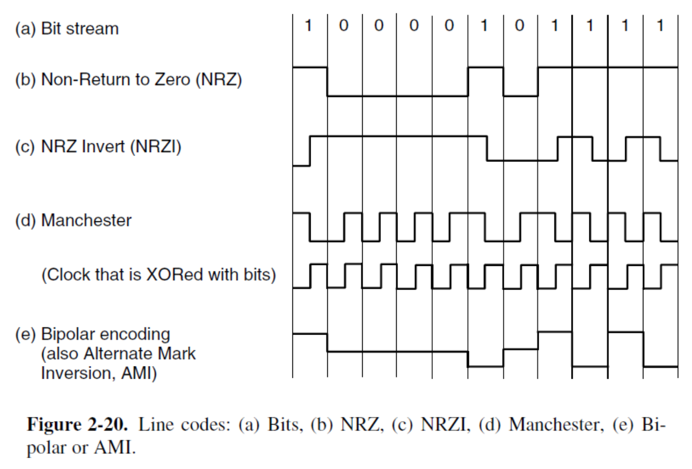

传统方式中, 以 NRZ 为例, 每一个 symbol 都只携带了一个 bit. 由此产生了一种方式, 规定4种电压分别对应2个bit的组合, 现在每个 symbol 就可以携带两个 bit. 相应的**所需带宽变为原来的一半**. 但要求接收器更强, 并且如果有噪声会导致出错.

Manchester 编码, 实际上在用两个 symbol 传输一个 bit. 要求**带宽变为原来的两倍**. 以太网使用此编码. 这个编码可以看成 NRZ 和 Clock 的异或.

NRZI 编码, USB 使用此编码.

Scrambling 干扰码, 故意在发送数据前将其与一串伪随机序列异或, 防止因发送重复数据而产生电磁干扰

Balanced signals 以 NRZ 编码为例, 如果发送一长串 111..., 信号会一直保持在 +5V, 它的平均电压显然不是零, 这就产生了很强的直流分量. 直流分量无法通过电容, 并且在同轴电缆中衰减很快. 采用 Bipolar Encoding 可以解决, 对同一个信号交替产生正负电平, 平均电压始终保持为零.

### Passband Transmission 通带传输

由于我们日常的信号频率较低, 如果想要无线发射, 根据 $c=\lambda f$, 需要较大的波长, 天线需要做得很大. 通过调制, 将原有的带宽处于 0 ~ B Hz 的信号, 转换到 S ~ S+B Hz, 从而便于无线发射

由此, 可以同时利用FDMA, 把不同的信号分别搬运到不同的频段上, 实现同时传输, 接收端只需要调谐到相应的频段即可

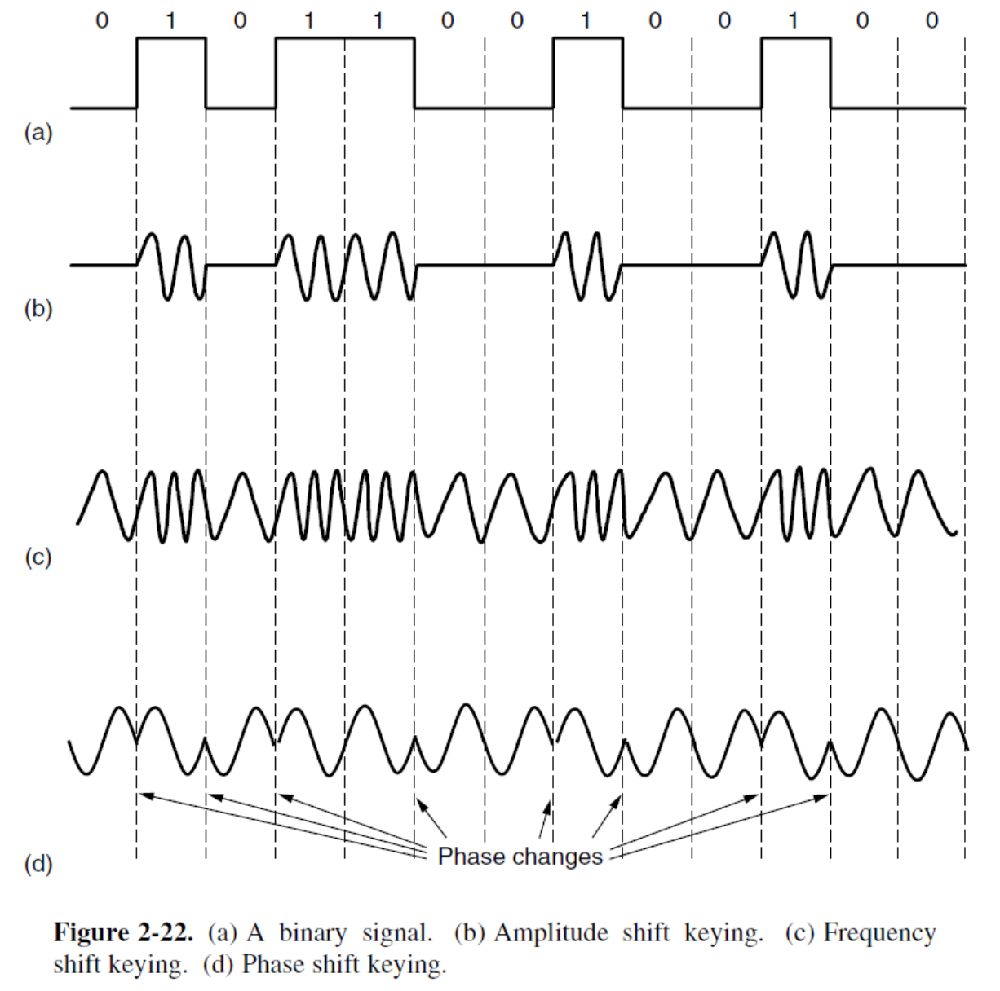

实现“搬运”的方法有三种：ASK (Amplitude Shift Keying), FSK (Frequency Shift Keying), PSK (Phase Shift Keying)

对于一个信号$A\sin{(2\pi ft + \omega)}$, ASK改变幅度, FSK改变频率, PSK改变相位

其中, BPSK (Binasy PSK) 用0和180度区分, QPSK (Quadrature PSK)用45, 135, 225, 315度区分

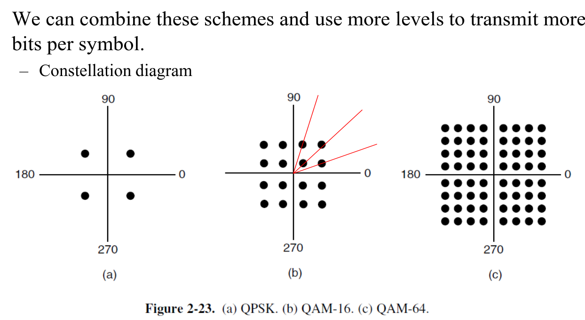

上图中每一个点都代表一个symbol, 点到原点的距离代表这个symbol的振幅, 与X轴的夹角代表这个symbol的相位. QAM-16, QAM-64均同时用到了ASK和PSK.

QAM-16有16种不同的symbol, 所以每个symbol可以携带4个bit. QAM-64有64种不同的symbol, 所以每个symbol可以携带6个bit.

问题：怎么计算QAM的Nyquist Bandwidth?

不设计成同心圆是因为方形的X和Y是独立的, 更容易在物理上制造

为了不在发生短暂噪声时引起过多bits错误, 采用格雷码：

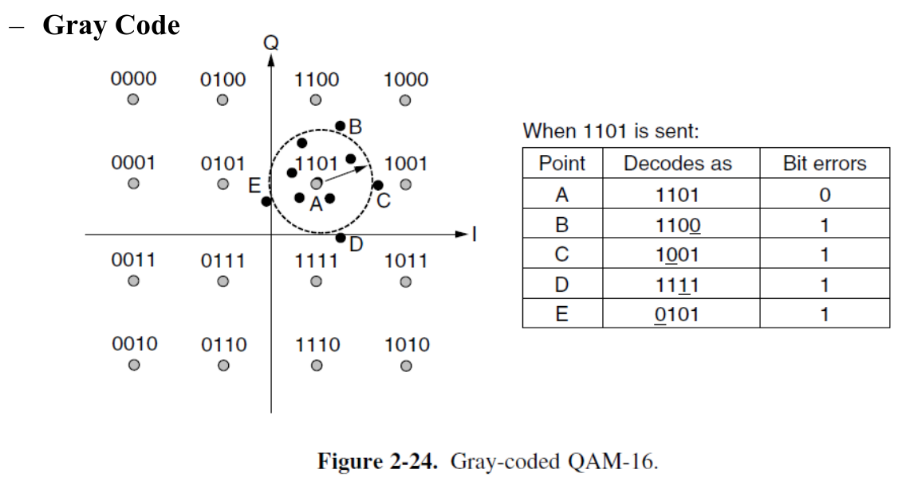

### Multiplexing

#### FDM

放到不同的频段上传输, 它们之间有隔离, 避免造成干扰 (interference)

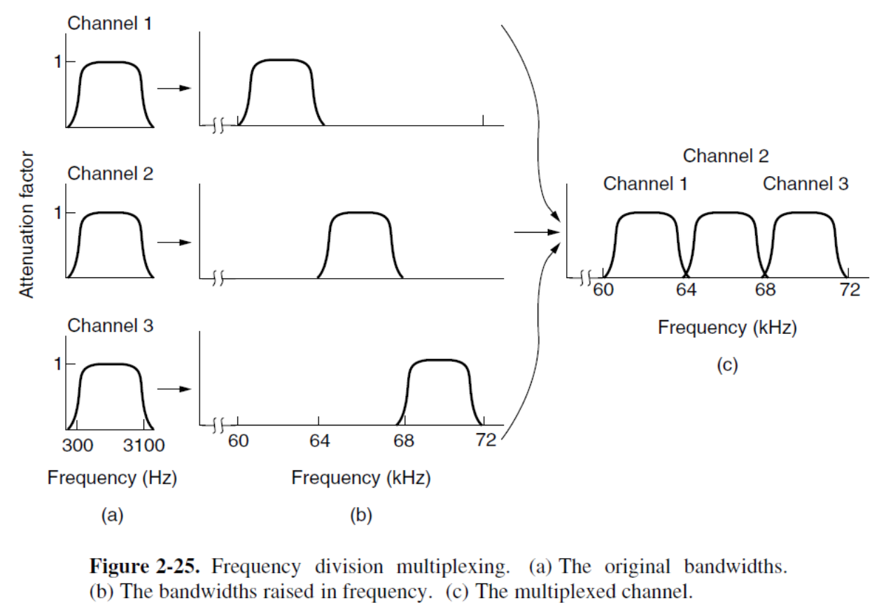

#### OFDM (Orthogonal FDM)

信号最高点恰好位于其他信号的最低点 (可以看成噪声). 信号之间有重叠, 没有隔离

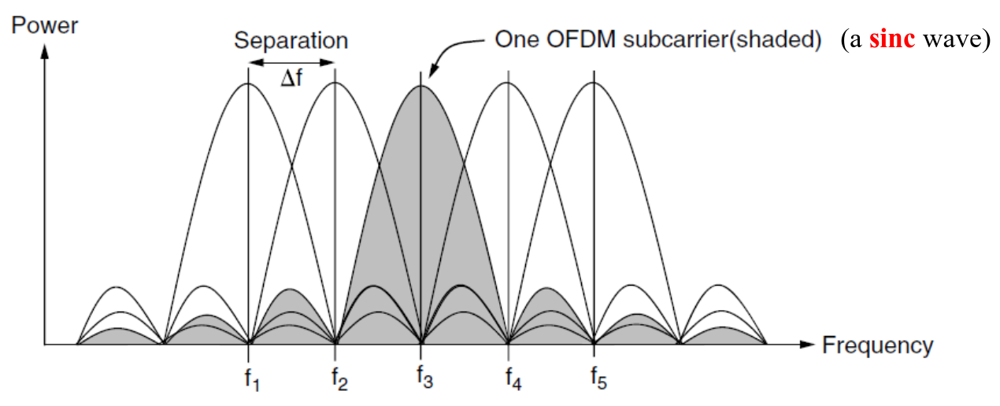

但在现实世界中（尤其是在室内或城市），信号会撞到墙壁、建筑物上再反弹回来，产生回声 (Echoes)。这种回声（专业上叫多径效应 Multipath）会导致信号的延迟，破坏完美的“峰值对零点”对齐，从而产生干扰。OFDM 不会 100% 的时间都在发数据。它在发送每一个Symbol之后，都会故意“暂停”一小段时间（这个暂停就叫 Guard Time）。在这段“暂停”期间，让那些乱七八糟的回声自己先“飞一会儿”并衰减掉。等到下一个符号的“正式数据”部分开始时，信道又恢复“干净”了，从而保护了“正交性”不受破坏。

#### TDM

排队轮流使用 (独占) 整个信道, 类似操作系统的Round Robin概念.

Guard Time 与 Synchronized: 和OFDM一样需要在时间片之间插入Guard Time, 防止因为时钟不同步导致错误 (发送端和接收端必须使用完全一致的时钟. 接收端必须精确地知道“第 1 毫秒的数据是给 1 号的，第 2 毫秒的数据是给 2 号的...”. 一旦时钟错位，所有数据都会被发给错误的人)

Sum rate: 为了保证传输速率, 这个信道的数据传输速率至少是所有输入流速率的综合. 例如, 如果输入 1, 2, 3 都是 1 Mbps, 那么输出信道的速率必须至少是 3 Mbps (再加上一点点Guard Time的开销)

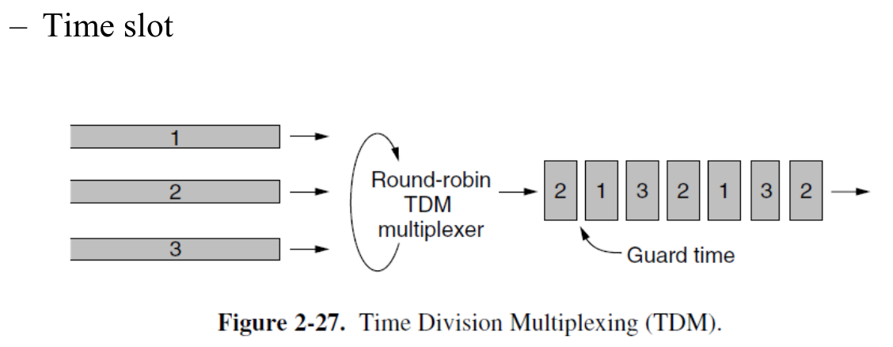

#### CDM