# Physical Layer

## Theoretical Basis

### Bandwidth-limited Signals 带限信号

**Cutoff Frequency ($f_c$, 截止频率)**: Usually, for a wire, the amplitudes are transmitted mostly undiminished from 0 up to some frequency $f_c$ (measured in cycles/sec or Hz), with all frequencies above this cutoff frequency attenuated.

**Bandwidth (带宽)**: 从最低$f$到$f_c$, 以Hz为单位

**Baseband Signals (基带信号) vs. Passband Signals (通带信号)**

Baseband Signals是原始信息信号，适合在有线介质中进行短距离传输, 基带信号通过调制 (Modulation) 搭载到高频载波信号上, 成为Passband Signals

Passband Signals适合无线传输

**Amplitude Modulation (调幅) vs. Frequency Modulation (调频)**

**Bandwidth vs. Maximum Data Rate**

对于electrical engineers, (analogue) bandwidth用Hz衡量

对于computer scientists, (digital) bandwidth表示maximum data rate (最大数据传输速率), 用bits/sec衡量

两者直接相关

### The Maximum Data Rate of a Channel

**Channel Capacity 信道容量**

The maximum rate (最大传输速率) at which data can be transmitted over a given communication path or channel under given conditions

**Related Concepts**

Data rate (bps, bits/sec)

Bandwidth: 每一路信号之间, 可能需要加上一定的间隔, 叫做guide interval; 一般来说, 带宽越大, 成本越高, optical fiber (光纤) 是目前成本最高的communication system

Noise: 噪声一般是随机的, 并且在不同频率下的影响可能不一样. 噪声高会导致Data rate下降, Error rate增大

Error rate: 传输的bit和接受的bit不一致, 就是发生了error.

### Nyquist Bandwidth

无噪声的信道 (perfect channel) 的传输容量 (transmission capacity) 依然是有限的, 本质就是因为带限

**Inter-Symbol Interference (ISI)**

图中的一个脉冲信号，是一个时限信号，经过傅里叶变换后可以看到它是一个**非带限信号**. 反过来，一个带限信号也只能是非时限信号. 一个时间上的方波脉冲，在频率上相当于$sinc(x)=\displaystyle\frac{\sin{\pi x}}{\pi x}$函数. 一个时间上的$sinc(x)$函数，在频率上相当于方波脉冲. 有限带宽会导致矩形脉冲的“理想方形”不再保持，边沿过渡区域会被拉长变斜

**Nyquist criterion for zero ISI**

在一个带宽只有$B$的信道上, 最快能以多块的速度$R_s$发送信号, 同时保证信号之间不互相干扰:

(1) 选择特殊的脉冲形状：$g(t)=\displaystyle\frac{\sin{2\pi Bt}}{2\pi Bt}$, 即带宽为$B$的矩形脉冲

(2) 最大符号速率 (maximum symbol rate): $R_s=2B (symbols/sec)$

**From symbol rate to bit rate**

这里一定要注意区分symbol rate, bit rate, 以及data rate的区别

symbol rate (也叫 baud rate, 波特率) 就是每秒可以传输多少个符号. 假设我们的信道带宽$B=1000 Hz$. 在这个例子中，最大符号速率$Rs​=2\times1000=2000(symbols/sec)$.

如果每个symbol只有两种状态, 即$\log_{2}{2}=1$个bit, 那么每秒传输的bit数目bit rate就是$2000\times1=2000(bits/sec)$

而一般来说, 传输的信息还包含纠错用的bits, 因此有效数据的量少于接收到的bits的量, 用data rate表示

**所以我们不难得出maximum bit rate的公式$C=2B\log_{2}{V}$, 其中$V$是一个symbol状态的数目**

但必须注意, 这里的$V$不是无限增长的, 因为处理这样的信号会变得越来越复杂

### Shannon Capacity

对于有高斯白噪声 (AWGN, additive white Gaussian noise) 的, 有带限的信道, $C=B\log_{2}{(1+SNR)}$, 其中$SNR$是**线性尺度下的信噪比 (signal-to-noise ratio in linear scale, not in dB)**, 实际上是无法达到这个最大值的

两种尺度下信噪比的转换公式: ${SNR}_{dB}=10\log_{10}{SNR}$

当信噪比较高时, 提升带宽可以显著增大$C$. 但信噪比较低时, 增大带宽带来的好处很小, 此时应该通过增大信号功率实现$C$的提升

对于同一个noise pattern, 如果提高了data rate, 则bits的时长变短了, 从而相同的noise可以影响到更多的bits

## Three Kinds of Transmission Media

Guided/Wired, Wireless, Satellite

### Guided Transmission Media

#### Persistent Storage 储存体

即磁盘/固态存储器, 使用物理运输方式 (如卡车) 传输, 带宽可以非常大, 延迟很高

#### Twisted Pairs 双绞线

是最古老的, 但也是用得最多的传输方式, 由两根绝缘铜线组成, 缠绕是为了防止两根平行线构成天线. 一般使用两根线中**电压的差值**来传输信号, 因为噪声往往对两条线施加相同的影响, 从而可以相减抵消. 模拟信号和数字信号都可以用双绞线传输. 双绞线的带宽取决于线粗和传输距离, 几公里的长度可以达到数Mbits.

全双工: 双向传输，可以同时

半双工: 双向传输，但不能同时

单工: 只能单向传输

常见的网线 (CAT 5) 是非屏蔽双绞线 (UTP)，依靠“缠绕”来抗干扰. 更高级的网线 (CAT 7) 则会在“缠绕”的基础上，为每一对线都增加屏蔽层，以实现更强的抗干扰能力和更高的数据速率

#### Coaxial Cable 同轴电缆

用于有线电视/城域网 (MAN)/高速互联网接入, 带宽可以达到GHz

#### Power Lines 电线

将高频信号叠加在低频信号 (50Hz) 上进行传输

电线本身设计就只为了传输电力, 当电器开关就会造成波动, 并且瞬态电流会在很宽的频率范围内产生噪声

#### Fiber Optics 光纤

带宽基本上是无限的, 由三部分组成: Light source, transmission medium, and detector

光线通过玻璃的衰减定义为输入与输出信号功率之比, 取决于光的波长

光纤电缆类似于同轴电缆, 只是没有那层编织网 (braid)

有两种信号光源: LED, Semiconductor lasers

光的常用波长有三个区域：

0.85-micron的波段常用于短距离的传输, 因为衰减最快

(a) core的折射率高于classing的折射率

(b) 展示了多模光纤 (multimode fiber), 另外还有单模光纤 (single-mode fiber), 更细

光纤的优点: 带宽大, 不受电涌 (power surges), 电磁干扰, 电源故障, 化学物质的影响, 重量轻, 不会漏光, 难以窃听 (tap)

光纤的缺点: 容易因弯曲过多而损坏

### Wireless

传统无线传输使用窄带传输 (Narrow Frequency Band). $\Delta f$是信号占据的带宽（频带宽度），$f$是中心频率。$\Delta f/f \ll 1$表示带宽相对于中心频率来说非常小

但是在三种特殊情况下, 使用了更宽的带宽:

(1) Frequency hopping spread spectrum 跳频技术, 每秒钟会改变数百次频率, 在蓝牙和802.11协议的旧版本中使用

(2) Direct sequence spread spectrum, 例如CDMA

(3) UWB (Ultra WideBand) 超宽带, 发射一系列短脉冲传输数据, 这种脉冲会分布到超宽的频率上

#### Radio Transmission 无线电

无线电波向各个方向发射, 因此发射天线和接收天线不必对准

在低频下, 无线电波容易穿过障碍物，但功率随着距离急剧下降，在空气中至少快到$1/r^2$, 这种衰减称为path loss

在高频下, 无线电波倾向于直线传播, 并且更容易发生反射

无线电波可以通过地波传播, 也可以经过大气层反射传播 (仅HF)

#### Microwave Transmission 微波

微波的频率更高, 几乎沿直线传播, 可以通过抛物面天线 (parabolic antenna) 获得更高的SNR, 但发射天线和接收天线必须对齐

如果塔架距离太远, 地球曲率会阻挡信号, 因此需要周期性地摆放中继器, 中继器的间距大致与$\sqrt{H}$成正比, 其中$H$是塔架高度

Multipath Fading: 当信号通过多条路径到达接收器时，这些延迟的波可能会与直射波异相到达，导致相互抵消，信号减弱甚至消失

#### Infrared Transmission 红外

用于短距离通信, 例如遥控器

相对定向, 但不能穿过固体

不需要获得政府许可

#### Light Transmission

不需要获得政府许可

容易受到风、温度、雾等等影响

### Satellites 卫星

三颗同步卫星就可以覆盖地球表面

相比Fiber的优势: 部署快, 在偏远地带用于通讯, 可以进行广播

## Digital Modulation and Multiplexing 数模转换和多路复用

数字信号必须转换成模拟信号 (Analog Signals) 才可以传输, 这一过程叫做数字调制 (Digital Modulation)

将数字信号转换成模拟信号后, 根据信道的类型, 主要有两种传输方式: 基带传输 (Baseband Transmission) 和通带传输 (Passband Transmission)

基带传输: 有线, 短距离, 转换后的模拟信号频率从 0 HZ 开始, 信号占据的最高频率取决于数据传输速率 (即每秒发送多少比特)

通带传输: 无线和光纤, 远距离, 通过调节幅度/相位/频率来承载比特, 信号占据的频率是围绕载波频率的一个频带 (带宽)

为了提高信道利用率，多路复用 (Multiplexing) 允许多个独立的信号同时使用一个共享信道. 可以用不同的频率 (频分复用) 或不同的时间片段 (时分复用) 来区分和合并信号

### Baseband Transmission 基带传输

传统方式中, 以 NRZ 为例, 每一个 symbol 都只携带了一个 bit. 由此产生了一种方式, 规定4种电压分别对应2个bit的组合, 现在每个 symbol 就可以携带两个 bit. 相应的**所需带宽变为原来的一半**. 但要求接收器更强, 并且如果有噪声会导致出错.

Manchester 编码, 实际上在用两个 symbol 传输一个 bit. 要求**带宽变为原来的两倍**. 以太网使用此编码. 这个编码可以看成 NRZ 和 Clock 的异或.

NRZI 编码, USB 使用此编码.

Scrambling 干扰码, 故意在发送数据前将其与一串伪随机序列异或, 防止因发送重复数据而产生电磁干扰

Balanced signals 以 NRZ 编码为例, 如果发送一长串 111..., 信号会一直保持在 +5V, 它的平均电压显然不是零, 这就产生了很强的直流分量. 直流分量无法通过电容, 并且在同轴电缆中衰减很快. 采用 Bipolar Encoding 可以解决, 对同一个信号交替产生正负电平, 平均电压始终保持为零.

### Passband Transmission 通带传输

由于我们日常的信号频率较低, 如果想要无线发射, 根据 $c=\lambda f$, 需要较大的波长, 天线需要做得很大. 通过调制, 将原有的带宽处于 0 ~ B Hz 的信号, 转换到 S ~ S+B Hz, 从而便于无线发射

由此, 可以同时利用FDMA, 把不同的信号分别搬运到不同的频段上, 实现同时传输, 接收端只需要调谐到相应的频段即可

实现“搬运”的方法有三种：ASK (Amplitude Shift Keying), FSK (Frequency Shift Keying), PSK (Phase Shift Keying)

对于一个信号$A\sin{(2\pi ft + \omega)}$, ASK改变幅度, FSK改变频率, PSK改变相位

其中, BPSK (Binasy PSK) 用0和180度区分, QPSK (Quadrature PSK)用45, 135, 225, 315度区分

上图中每一个点都代表一个symbol, 点到原点的距离代表这个symbol的振幅, 与X轴的夹角代表这个symbol的相位. QAM-16, QAM-64均同时用到了ASK和PSK.

QAM-16有16种不同的symbol, 所以每个symbol可以携带4个bit. QAM-64有64种不同的symbol, 所以每个symbol可以携带6个bit.

问题：怎么计算QAM的Nyquist Bandwidth?

不设计成同心圆是因为方形的X和Y是独立的, 更容易在物理上制造

为了不在发生短暂噪声时引起过多bits错误, 采用格雷码：

### Multiplexing

FDMA/TDMA 是 带宽受限（Bandwidth-limited） 的：频率切完了就没法加人了
CDMA 是 干扰受限（Interference-limited） 的：理论上可以一直加用户，但用户越多，背景“噪声”底噪就越高，直到信噪比（SNR）低到无法解调为止。

#### FDM

放到不同的频段上传输, 它们之间有隔离, 避免造成干扰 (interference)

WDM和FDM实际上是一回事

#### OFDM (Orthogonal FDM)

信号最高点恰好位于其他信号的最低点 (可以看成噪声). 信号之间有重叠, 没有隔离

但在现实世界中（尤其是在室内或城市），信号会撞到墙壁、建筑物上再反弹回来，产生回声 (Echoes)。这种回声（专业上叫多径效应 Multipath）会导致信号的延迟，破坏完美的“峰值对零点”对齐，从而产生干扰。OFDM 不会 100% 的时间都在发数据。它在发送每一个Symbol之后，都会故意“暂停”一小段时间（这个暂停就叫 Guard Time）。在这段“暂停”期间，让那些乱七八糟的回声自己先“飞一会儿”并衰减掉。等到下一个符号的“正式数据”部分开始时，信道又恢复“干净”了，从而保护了“正交性”不受破坏。

#### TDM

排队轮流使用 (独占) 整个信道, 类似操作系统的Round Robin概念.

Guard Time 与 Synchronized: 和OFDM一样需要在时间片之间插入Guard Time, 防止因为时钟不同步导致错误 (发送端和接收端必须使用完全一致的时钟. 接收端必须精确地知道“第 1 毫秒的数据是给 1 号的，第 2 毫秒的数据是给 2 号的...”. 一旦时钟错位，所有数据都会被发给错误的人)

Sum rate: 为了保证传输速率, 这个信道的数据传输速率至少是所有输入流速率的综合. 例如, 如果输入 1, 2, 3 都是 1 Mbps, 那么输出信道的速率必须至少是 3 Mbps (再加上一点点Guard Time的开销)

#### CDM

In CDMA, each bit time is subdivided into m short intervals called
chips.

每个bit，都用多个chips表示，一般来说m取64或128

chips的频率比bits快，会导致所需带宽增大

Each station has its own unique chip sequence - Walsh codes

但是，如果每个Station有自己的chip sequence，并且相互之间正交，那么每个人都可以使用这个信道，并且他们之间的干扰会降到最低（相比FDM，可以将信号能量扩散到更宽的频带上，使得信号抗干扰能力极强）

对于接收者来说，其他用户的信号看起来就像背景白噪声。只有用正确的码（例如Gold codes和Walsh codes）去解调，才能从中提取出有用的信号

CDM和TDM一样需要注意时间同步的问题

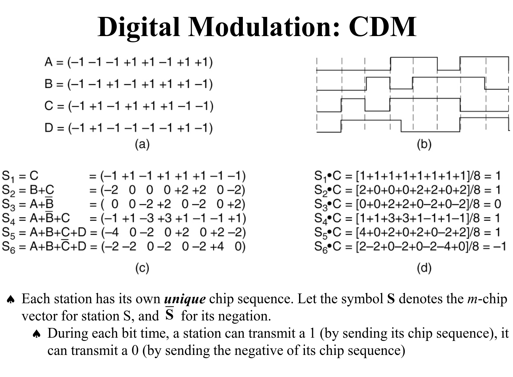

上图，A、B、C、D表示四个Station，它们分别有自己的chip sequence，分别正交（看成向量，相乘为0）。当发送这个sequence时表示发送了bit 1，发送这个sequence的补码时表示发送了bit 0。S表示某一时刻信道中实际存在的混合信号总和

## Three Communication Examples 三个实际例子

### Public Switch Telephone Network (PSTN) 电话网络

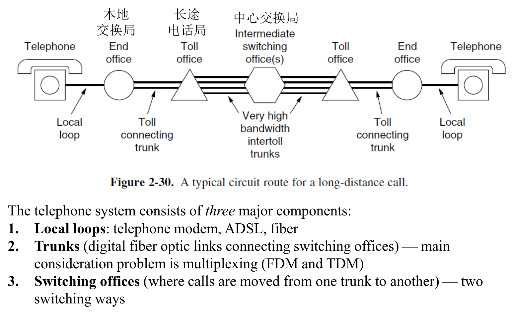

PSTN有以上三个主要的部分组成

#### Local Loops 本地环路

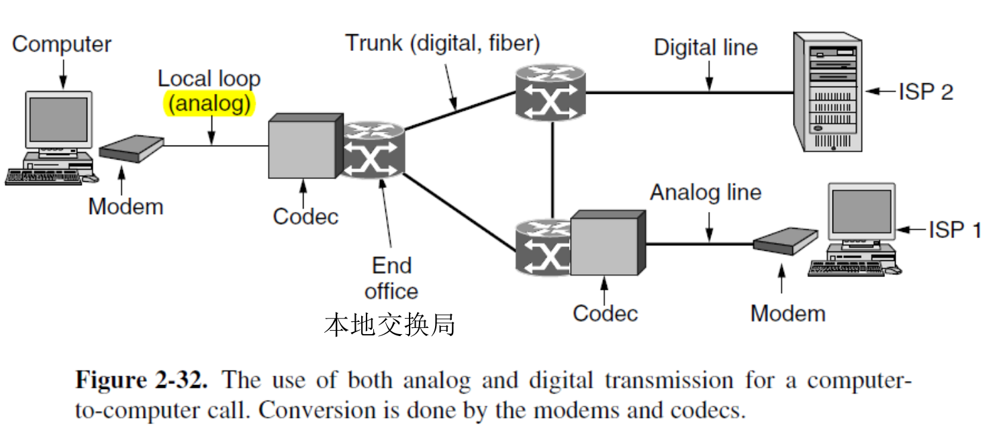

这里特别做一个铺垫，为了无损地还原一个模拟信号，采样频率（Sampling Frequency, $f_s$​）必须至少是该信号最高频率$f_{max}$​的两倍。这就是Nyquist Sampling Limit，注意与Nyquist Bandwidth的区别。一旦采样率达到了$2f_{max}$​，就已经在数学上捕获了该信号的全部信息，因此再继续提高采样率，还原出来的波形也是完全一样的。但是一旦低于$2f_{max}$​，原始波形的信息就永久丢失了。现实中的信号一般是时限的，因此总是会有无穷大的频率分量。所以在采样之前，我们必须先把信号通过一个低通滤波器（Low Pass Filter），强行把高频部分切掉，把信号变成了Bandlimited带限信号，然后再采样。如果不切掉高频，它们就会折叠回来变成噪声。

人说话的声音主要集中在300Hz ~ 3400Hz之间，为了保留guard bands，电信业将话音信号的有效带宽定为4000Hz。根据定理，采样频率必须是最高频率的2倍，因此现代数字电话系统（PCM）的标准采样率是8000Hz。

The number of bits per sample in the U.S. is 8, one of which may be used for control purposes, allowing 56 kbps for user data. In Europe, all 8 bits are available to users, so 64 kbps modems could have been used.

这段话就很容易理解了。注意，采样（8000 samples/sec）+量化（7 bits/sample还是8 bits/sample），缺一不可。

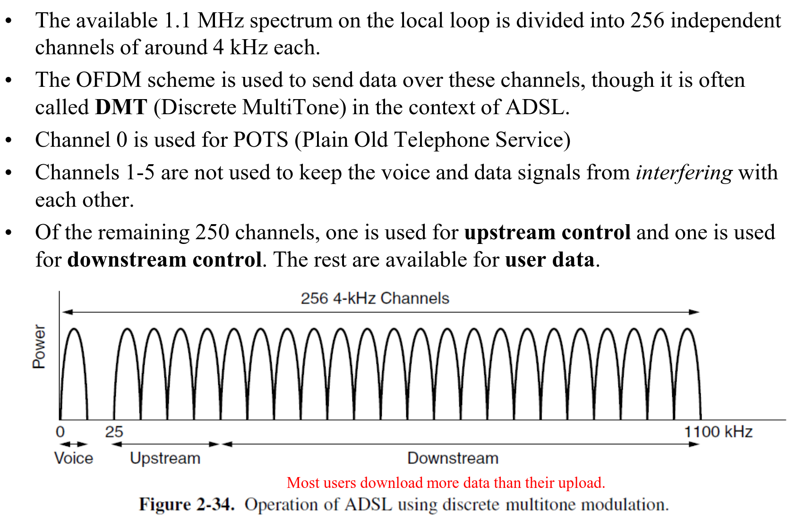

上面这张图说明了Local Loop频谱划分的情况。总共1.1MHz，分为256份，每一个信道大约4kHz，这和OFDM是比较类似的（也可以叫DMT）。特别注意，1-5是不使用的，防止数据干扰语音。另外，用于upstream的信道数量少于downstream，因为一般下载的需求大于上传。以下是一个简易的图解：

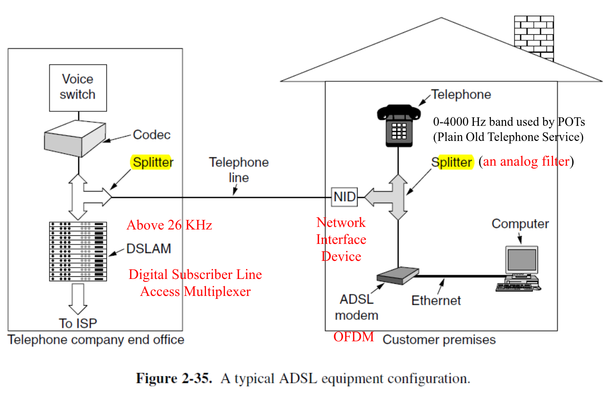

现在，老的铜缆Local Loop限制了ADSL和电话调制解调器的性能，因此有了光纤入户。通常情况下，来自各户的光纤会汇合在一起，这样每组最多 100 户人家只有一根光纤到达终端局。在下行方向上，optical splitter将终端局发出的信号分成两路，以便每户人家都能接收到信号。只有一户人家能够解码自己的信号，需要加密以确保安全。在上行方向上，optical combiner将来自各户人家的信号合并成一个单一信号，该信号到达终端局。为了防止上行和下行打架，两者使用不同波长的光（即频率不同，FDM）。

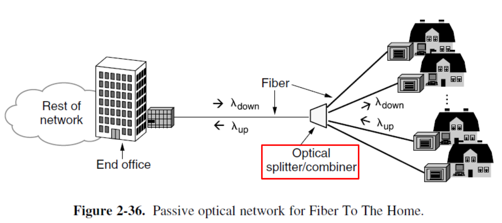

图中间的Optical splitter/combiner是一个纯物理的光学玻璃器件，不需要插电，是无源的，因此这个网络是PON (Passive Optical Network，无源光网络)，这是目前全世界光纤入户的主流标准。

#### Trunks 主干网

Trunks比Local Loops速度快很多，除此之外，还有这两个区别：

1. 传输bits，而不是声音
2. 可以同时承载成千上万甚至数百万个通话，通常使用TDM和FDM

在电话网络发展的早期，Trunk以模拟信息的形式处理语音call。FDM技术就用于将4000 Hz的语音信道复用成越来越大的单元。例如，60 kHz至108 kHz频段内的12个call称为一个group，5个组（共60个call）称为一个supergroup，以此类推，越来越粗

FDM需要模拟电路，TDM则可以完全由数字电路实现

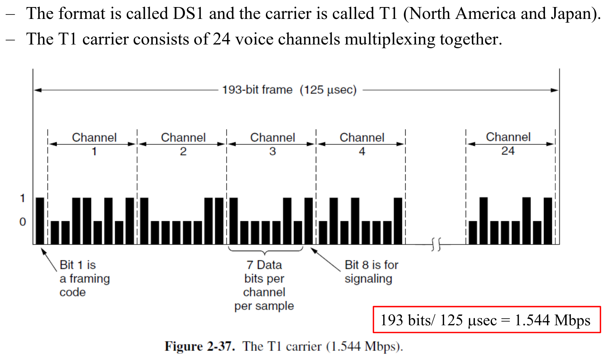

上图展示了非常经典的T1载波（T1 Carrier）标准。使用TDM技术，把时间切片，轮流发24个人的数据，每个信道在每次采样中分配 8 bit。最开头还有一个framing bit，为了让接收端知道这一帧是从哪里开始的。语音必须每 125 μsec（1/8000kHz）采样一次，所以帧长被固定在 125 μsec。每帧$1+24\times8=193$ bits，因此速率为$193$ bits / $125$ μsec $=1.544$ Mbps

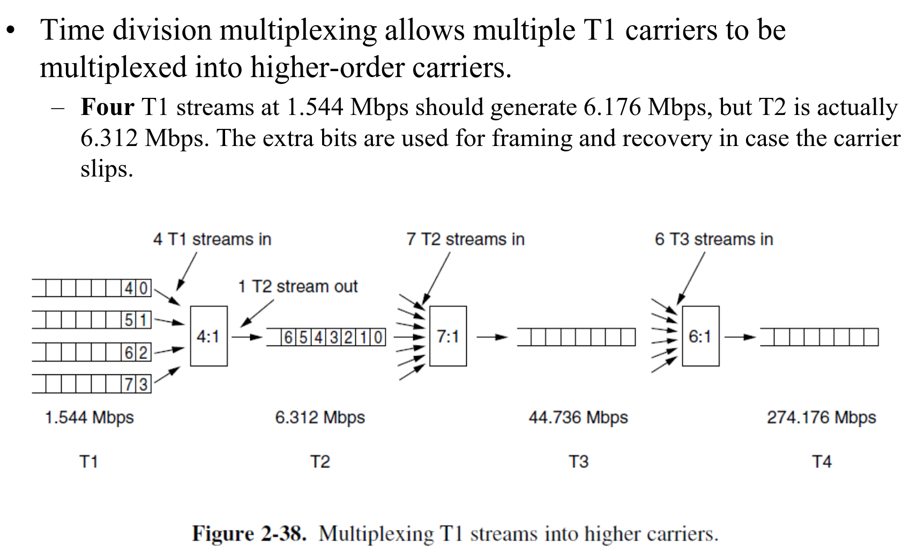

上图展示了，在T1载波的基础上，可以进一步使用TDM将多个T1stream合并，以此类推。由于加入了一些控制字节，因此总是会比整倍数大一点。

在T1标准之后，Bellcore 提出了 SONET 标准，国际上对应的标准为 SDH。和T1一样，也是靠切分时间片来传输数据的，但它是二维的切分。

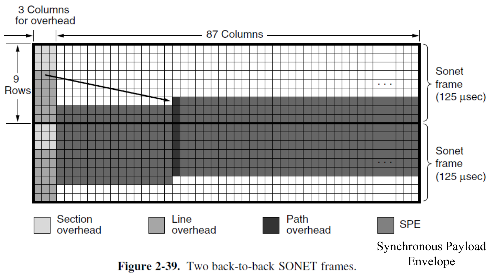

SONET的一帧是一个9行×90列的字节矩阵，总大小为$9\times90=810$ bytes$=810\times8$ bits$=6480$ bits。据此，就可以计算SONET的基础速率为$6480$ bits / $125$ μsec $=51.84$ Mbps

#### Switching 电路交换

Circuit Switching：通话建立后，两端之间便会建立一条专用的物理路径，该路径将持续存在直至通话结束。发送任何数据之前，都需要建立端到端的路径。数据的唯一延迟是电磁信号的传播时间，这个延迟是极短的，约为每1000公里5毫秒。

Packet Switching：不需要预先设置专用路径，也没有固定路径，路由器负责将每个数据包单独发送到目的地。数据包大小有上限。存在排队延迟和拥塞的问题（两个包同时走同一个路径）。

虽然两者在当今的电信网络中都很普遍，但趋势无疑是朝着Packet Switching的方向发展

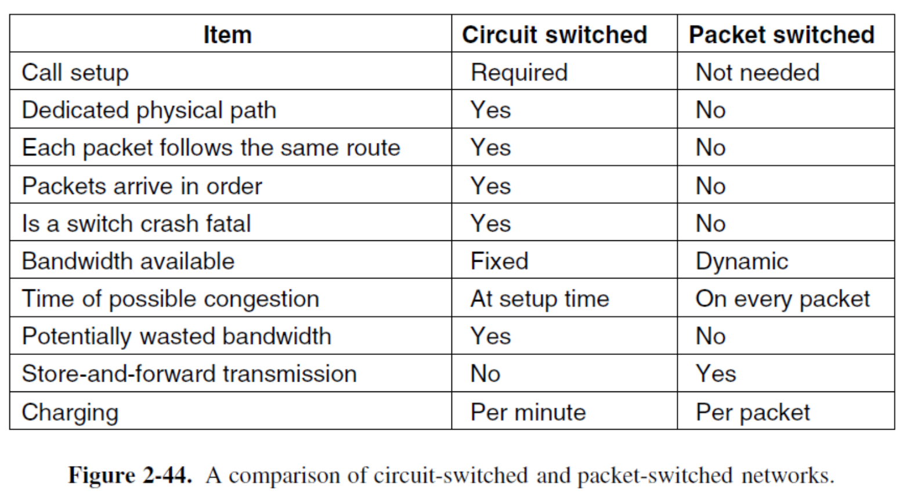

下面两个简单的问题中就可以看出Packet Switching的优势：

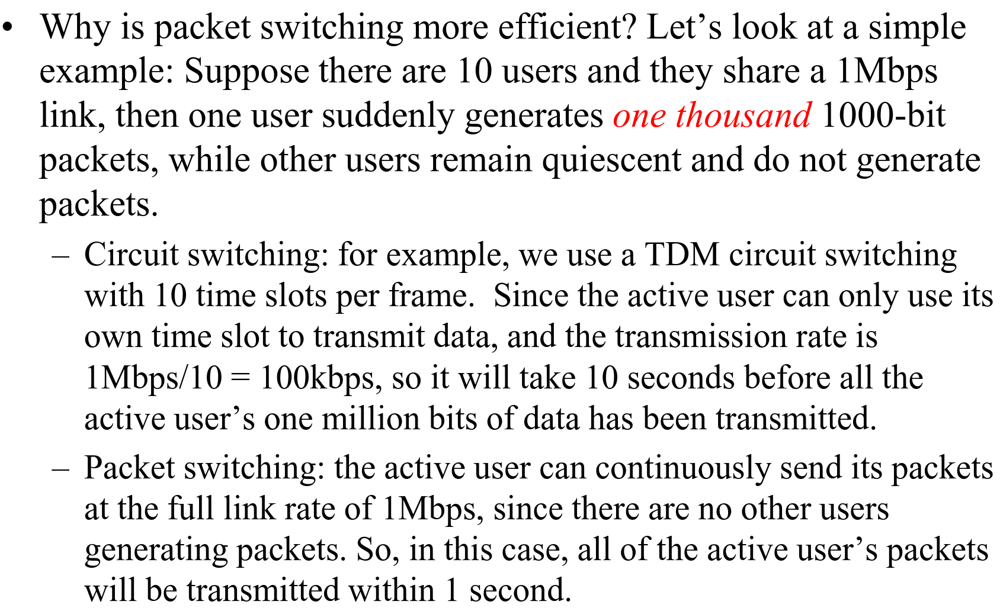

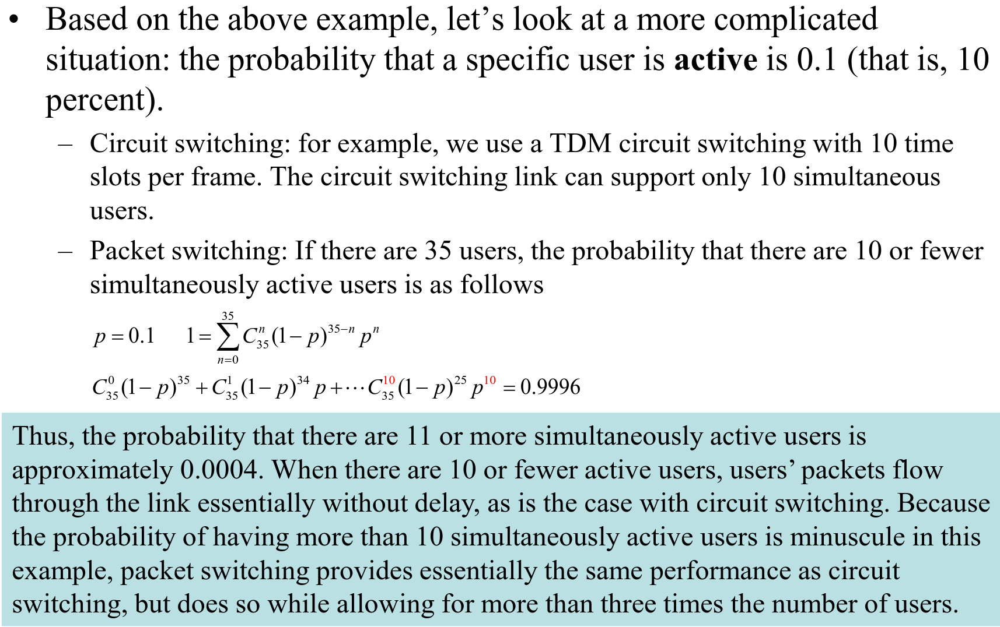

### Cellular Networks 蜂窝网络

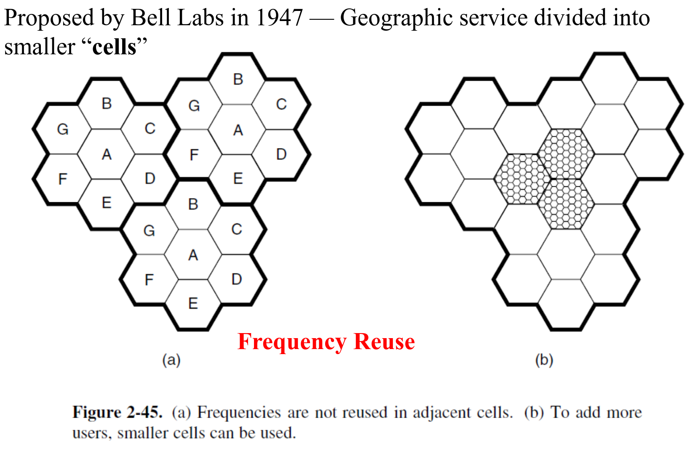

邻接的7个cell都使用不同的频段。在人员流动非常大的地方，应当继续把大的cell划分为更小的cell

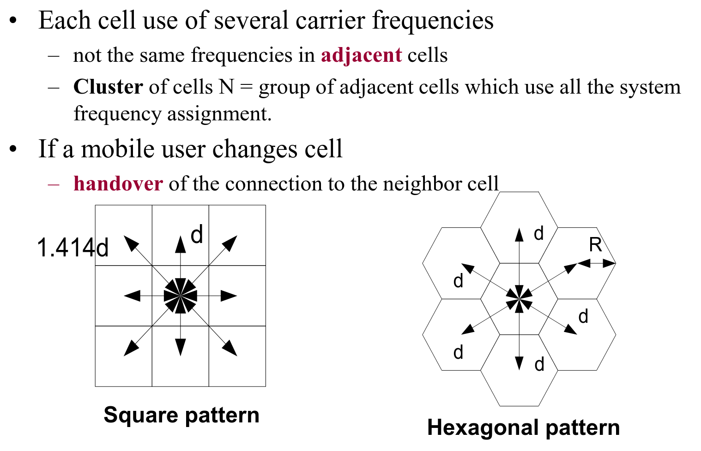

为什么不使用其他形状？

理论上，基站的全向天线发出的信号是向四面八方传播的，覆盖范围最自然的形状是圆形。但是，如果用圆去覆盖一个城市，要么产生大量重叠，导致严重的同频干扰，要么有大量空隙，导致信号盲区。

而正方形邻居的距离差异很大，正六边形是各向同性的。

以2G网络的基础GSM为例：

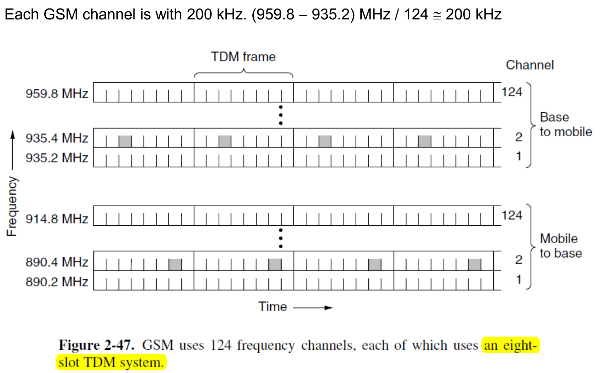

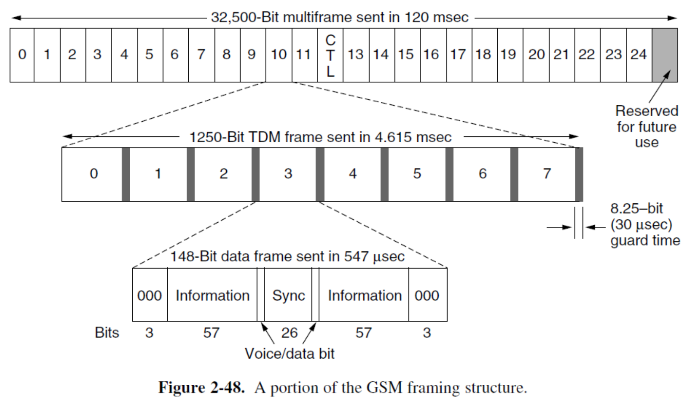

可以自行进行验算

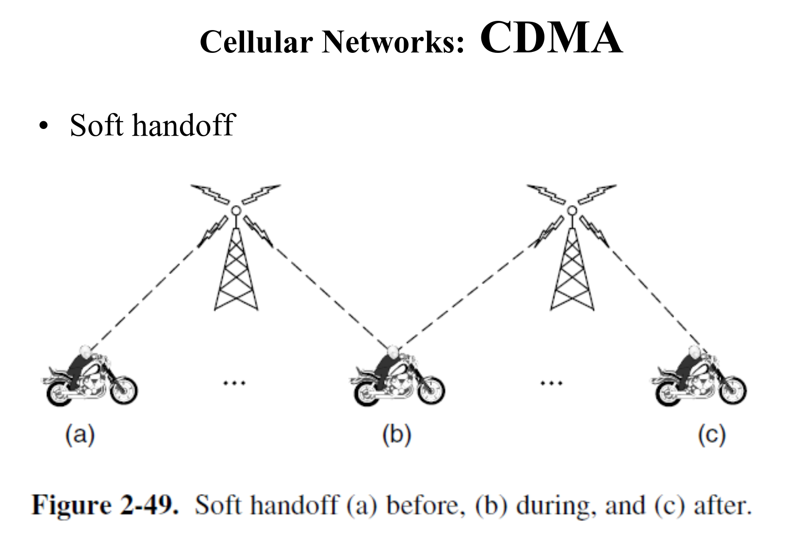

CDMA中有一个Soft Handoff机制，在移动通信中，当从一个基站覆盖区移动到另一个基站覆盖区时，通话链路必须转移。

硬切换 (Hard Handoff): (如 GSM) 是“先断后通”。就像你荡秋千换手抓杠，必须先松开一只手，瞬间腾空，再抓另一只。如果抓慢了，通话就断了。

软切换 (Soft Handoff): (如 CDMA) 是“先通后断”。就像你此时两只手同时抓着两个杠子，确信抓稳了新的，才松开旧的。

GSM (及 FDMA/TDMA): 相邻的基站为了防止干扰，必须使用不同的频率。手机只有一个无线电收发器，不可能同时工作在两个不同的频率上。所以它必须切断旧频率，调整电路，再接入新频率。这就导致了“硬切换”。

CDMA: 所有基站都使用相同的频率（通过不同的“码”来区分）。因为频率一样，手机的无线电模块可以毫不费力地同时接收来自两个、甚至三个基站的信号。

### Cable Networks 有线电视网络

早期的有线电视系统，单向传输：

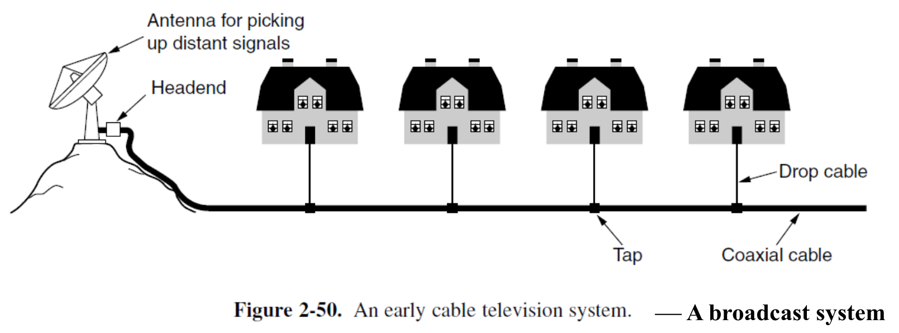

如今的有线电视系统：

光纤提供更大的带宽。需要用双向amplifier替换单向的，以支持上行和下行传输

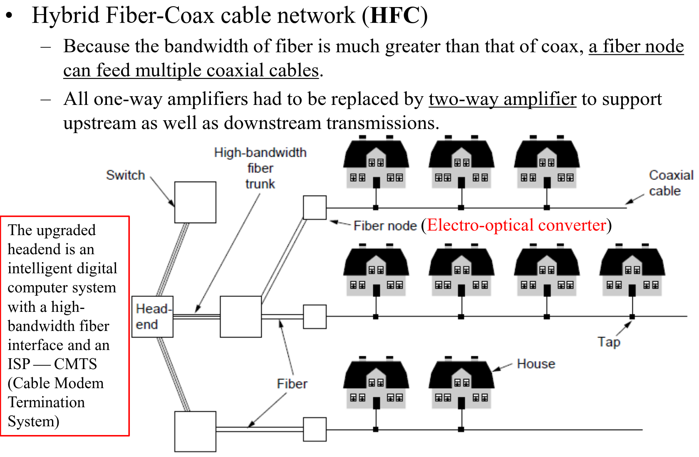

为了允许电视信号和网络信号在同一根线上传输，使用FDM：

上行和下行的带宽是非对称的

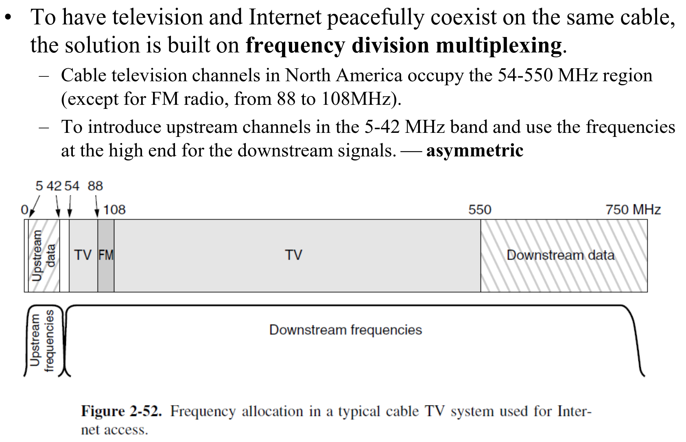

主要的协议是DOCSIS（Data Over Cable Service Interface Specification）

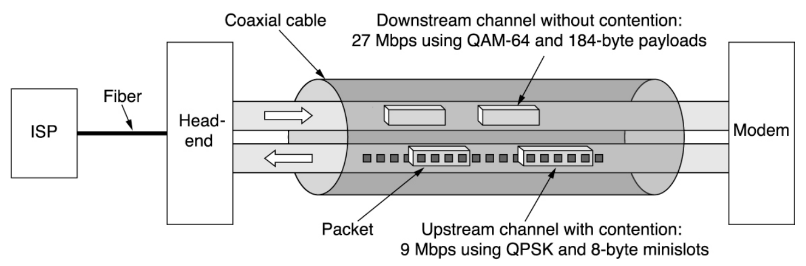

下行没有collision，因为只有一个发送者即headend；而上行有，因为有很多个用户共用这一根线发数据

ADSL（电话线上网） vs. Cable（有线电视线上网）哪个更好？

Cable: 使用同轴电缆 (Coax)，抗干扰能力强，频带极宽，理论传输能力是双绞线的几百倍

ADSL: 使用双绞线 (Twisted pair)，它是为了传模拟语音设计的，并没有打算用来传高速数据，抗干扰差，物理上限很低

虽然同轴电缆带宽大，但它的大部分空间已经被拿去传电视信号了，所以两者没有好坏之分